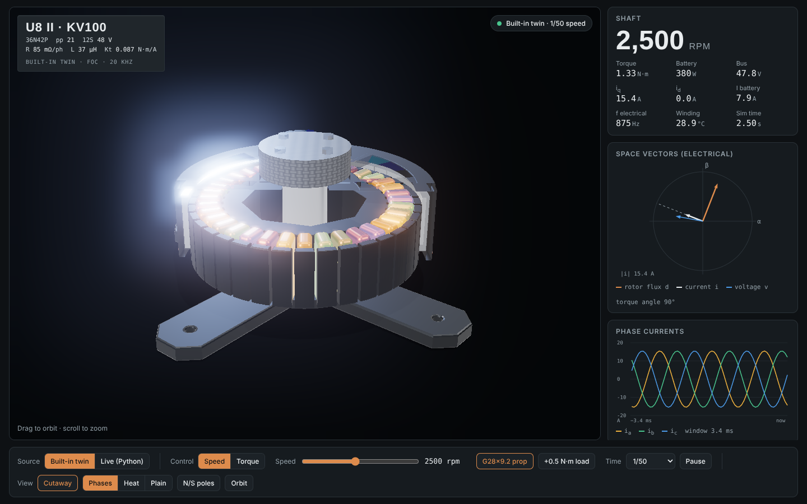
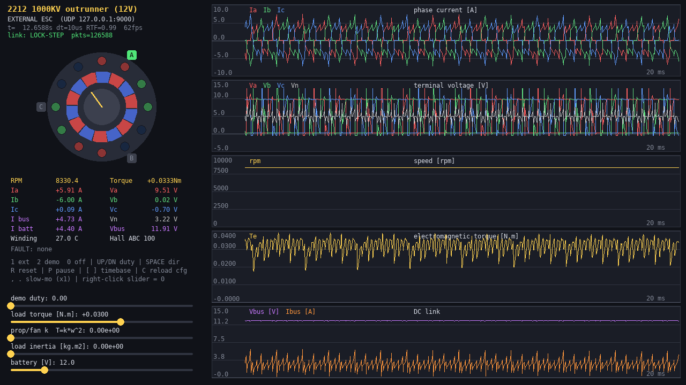
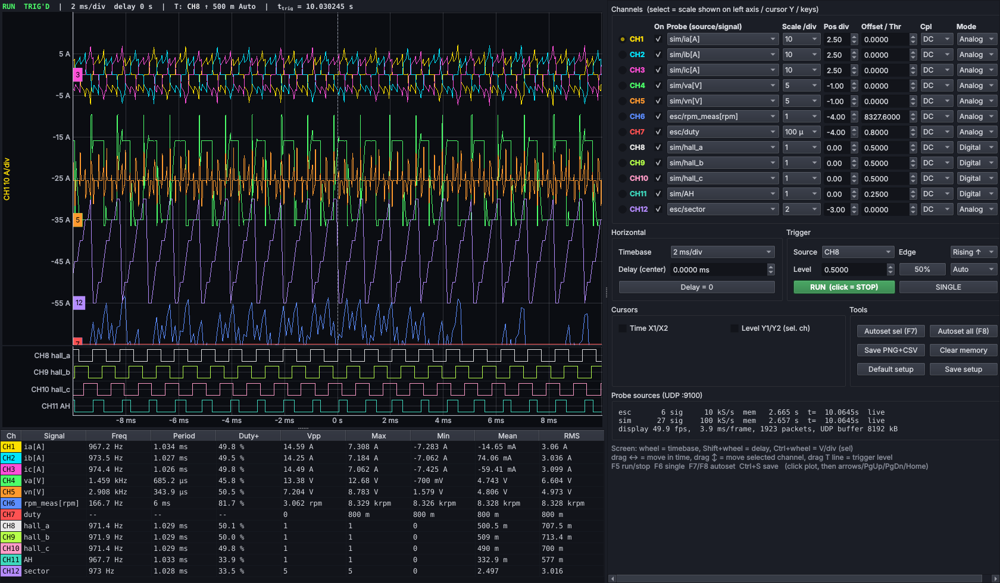
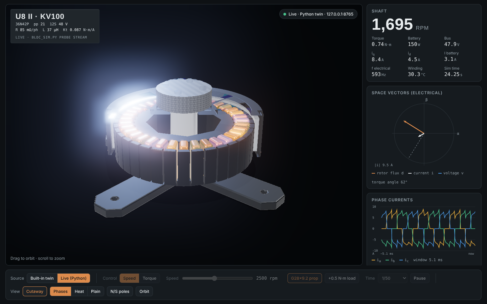

# BLDC Motor + ESC Digital Twin — FOC, 12-Channel Scope, 3-D Web Visualizer

[](https://github.com/kumarnitish378/bldc-esc-digital-twin/actions/workflows/tests.yml)

A test bench for developing ESC (electronic speed controller) firmware without hardware. It has five parts:
- **Motor twin:** a physics-based BLDC motor + inverter + battery that you drive with real gate signals.
- **FOC ESC:** a field-oriented-control ESC with encoder and sensorless modes, tested against a T-Motor U8 II KV100 model built from the datasheet ([test report](docs/FOC_TEST_REPORT.md)).
- **12-channel scope** to debug both the motor and your ESC.
- **3-D web visualizer** that shows the motor running, live.



A configurable, physics-based BLDC motor + 3-phase inverter + DC-bus simulator. Your **ESC program** (a separate process, any language) drives it with **6 gate signals (AH AL BH BL CH CL)** or 3 phase duties, and gets back **phase currents, bus/battery current, RPM**, terminal voltages (for sensorless BEMF), hall bits, torque, temperature and faults.

Plus a **12-channel digital oscilloscope** (`scope12.py`, PyQt + pyqtgraph). It can probe every internal signal of the motor and any variable inside your ESC program, on one shared simulation time base.

```
pip install -r requirements.txt                 # numpy, pygame, pyqtgraph, PyQt6 (PySide6/PyQt5 also work)
python bldc_sim.py                      # motor: UI + UDP server on 127.0.0.1:9000, uses motor_config.json
python scope12.py                       # oscilloscope: auto-probes the motor sim, listens for probes on :9100
python example_udp_esc.py               # example external ESC (lock-step), publishes its internals to the scope
python bldc_sim.py --demo 0.5           # or spin the motor with the built-in 6-step ESC
python example_inprocess_pwm.py         # ESC + motor in one process, real 20 kHz gate PWM, streamed to the scope
python bldc_sim.py motor_57bly_24v.json # another motor

# FOC ESC on the T-Motor U8 II KV100 model
python bldc_sim.py motor_tmotor_u8ii_kv100.json
python foc_esc.py --rpm 3000            # encoder FOC (auto encoder alignment)    [2nd terminal]
python foc_esc.py --sensorless --rpm 2500   # sensorless FOC (I/f start -> flux observer)
python foc_tests.py                     # full FOC test campaign -> docs/foc_report/ + docs/FOC_TEST_REPORT.md

# 3-D web visualizer (live view of whatever the sim is doing)
python viz_bridge.py                    # then open http://127.0.0.1:8765
```

## Files
| file | what |
|---|---|
| `bldc_model.py` | the physics (no pygame). Import `BLDCMotor`, `MotorConfig` directly for fast/headless/CI tests |
| `bldc_sim.py` | digital-twin UI (motor view, 5 scopes, live load sliders) + UDP server. Physics runs in its own process |
| `bldc_protocol.py` | UDP packet format + `pack_cmd()` / `unpack_reply()` helpers for your ESC program |
| `motor_config.json`, `motor_57bly_24v.json` | example motors (drone 2212 1000KV, industrial 24 V 57BLY) |
| `example_udp_esc.py` | external ESC over UDP, hall 6-step, soft start |
| `example_inprocess_pwm.py` | gate-level complementary PWM with dead time, in-process |
| `scope12.py` | 12-channel oscilloscope digital twin UI (PyQt + pyqtgraph) |
| `scope_core.py` | scope acquisition memory, UDP receiver, trigger / peak-detect / measurement DSP (no GUI) |
| `scope_probe.py` | probe library: `ScopeProbe` (put in your ESC code), `MotorProbe`, packet format |
| `foc_esc.py` | **FOC ESC**: dq current control, SVPWM, speed loop, field weakening, encoder + sensorless observer, motor detection; UDP runner |
| `foc_bench.py`, `foc_tests.py` | in-process ESC + motor bench and the FOC test campaign (plots + `results.json`) |
| `motor_tmotor_u8ii_kv100.json` | T-Motor U8 II KV100 (36N42P, 12S) + G28×9.2 prop, from the T-Motor datasheet |
| `docs/FOC_TEST_REPORT.md` | FOC test report: detection, loop responses, datasheet validation, ripple vs 6-step, sensorless, regen, protections |
| `web/motor_visualizer.html` | **3-D web motor visualizer** (Three.js, single file): built-in FOC twin or live data |
| `viz_bridge.py` | serves the visualizer and streams the running sim to it over WebSocket (no extra packages) |
| `tests/` | pytest suite: motor physics vs theory, protocol, scope DSP, UDP server robustness, FOC loops |

## Screenshots
| Motor digital twin (`bldc_sim.py`) | Scope with motor + ESC probes in lock-step |
|---|---|
|  |  |

## What the model contains
**Electrical (per tick, dt = 10 µs default):** Star-connected windings with a floating neutral and per-phase R and L (L = self − mutual). For each phase:
`L di/dt = v_node − v_n − R·i − e`, with Σi = 0 and v_n solved from the connected phases.
- **Back-EMF** `e = Ke·ω·f(pp·θ)`, where f is a trapezoid (120° flat), a sine, or a blend. Ke comes from Kv (`Ke = 1/(2·Kv_rad)`, phase peak), so no-load speed ≈ Kv·Vbus in 6-step.
- **Inverter:** MOSFET Rds_on, dead time and Hi-Z handling. When both FETs of a leg are off, current freewheels through the body diodes (Vf) until it reaches zero. After that the phase floats, so its terminal voltage = v_n + e (sensorless zero-crossing works). Above-bus BEMF rectifies through the diodes (uncontrolled regen). Turning on AH+AL together gives a shoot-through fault.
- **Inductance saturation** is optional: `L = L0/(1+(I/Isat)²)`.
- **DC bus:** battery EMF + internal resistance + bus capacitor, so you get supply sag under load and bus-current ripple. Regen goes either into the battery (`allow_regen_to_battery: true`) or, for a bench PSU, pumps the bus voltage up and raises an over-voltage fault. `ideal_supply: true` gives a rigid bus.

**Mechanical:** `J dω/dt = Te − T_cog − T_friction − T_load`
- Electromagnetic torque comes from the power balance, `Te = Ke·Σ f_k·i_k`. That reproduces the real commutation torque ripple.
- Cogging: `T_cog·sin(lcm(slots, 2pp)·θ)`.
- Viscous + Coulomb friction.
- Load = constant (signed) + Coulomb + viscous + **propeller/fan `k·ω|ω|`** + extra inertia, all live-adjustable.

**Thermal:** single-node winding model (Rth, Cth). Copper resistance rises with temperature (α = 0.393 %/K) and magnet flux drops (tempco), so a hot motor draws more current and spins slower, just like a real one.

**Sensors:** 3 hall sensors with a configurable mounting offset (`hall_offset_deg`, where 30 = ideal 6-step edges), and optional current-sensor noise.

Validated against theory: no-load 11 911 rpm vs 12 000 ideal at 12 V/1000 KV (the gap is friction + Rds drop). Stall current matches V/(2R+2Rds). Regen braking pushes current back into the battery.

## Configuring a motor
Copy a JSON and edit it. Every field is listed in `MotorConfig` in `bldc_model.py` with its unit. In the UI, **C** hot-reloads the file. Typical datasheet mapping:
- `kv_rpm_per_v`: Kv, or `1000 / Ke[V/krpm]` if the datasheet gives line-line Ke.
- `phase_resistance_ohm` = R(line-line) / 2.
- `phase_inductance_h` = L(line-line) / 2.
- `pole_pairs` = magnet poles / 2.
- `slots` = stator teeth.
- `rotor_inertia_kgm2` from the datasheet (g·cm² × 1e-7).

## UDP interface (your ESC program ↔ sim)
Send a 24-byte command to `127.0.0.1:9000`. You get a 72-byte reply. Layout is in `bldc_protocol.py`. In Python:

```python
from bldc_protocol import *
sock.send(pack_cmd(MODE_GATES, gates=G_AH | G_BL, advance_us=10))   # A high, B low, C floating
fb = unpack_reply(sock.recv(REPLY_SIZE))
fb["ia"], fb["ib"], fb["ic"], fb["i_bus"], fb["rpm"], fb["hall"], fb["va"], fb["v_bus"] ...
```
From C/C++, mirror the structs (`#pragma pack(1)`, little-endian):

```c
struct Cmd   { uint8_t mode, gates, flags, pad; float duty[3], load_nm, advance_us; };          // 24 B
struct Reply { double t; float theta, omega, rpm, ia, ib, ic, i_bus, i_batt, v_bus,
               va, vb, vc, vn, torque, temp; uint8_t hall, fault, pad[2]; };                      // 72 B
```

**Modes**
- `MODE_GATES` (0): `gates` = the real gate pins. You produce PWM yourself, so send a packet at every edge. Use a small `advance_us`, e.g. 2.5–10 µs.
- `MODE_DUTY` (1): averaged complementary half-bridges. `duty[k]` sets the node voltage to `duty·Vbus`. Bits AH/BH/CH (0x01/0x04/0x10) enable each leg; a disabled leg is Hi-Z. This is the fast choice for FOC/SVPWM or 6-step with one packet per PWM period (e.g. `advance_us=50` for 20 kHz).

**Timing**
- **Lock-step** (`advance_us > 0`, recommended): the sim advances exactly that much motor time per packet, then replies. Results are deterministic and independent of PC speed, and the UI shows "LOCK-STEP".
- **Free-run** (`advance_us = 0`): the sim runs in real time and your packet just updates the gates. If no packet arrives for 0.5 s, all FETs float (like a dead ESC).

**Other fields**
- `flags` bit0 resets the motor.
- `load_nm` sets the load torque from your test script (NaN = leave unchanged).

**Faults:** bit0 shoot-through (latched until reset), bit1 winding > 150 °C, bit2 bus > 1.3 × battery.

Sign convention: phase current is positive **into** the motor, and `i_bus` is positive drawn from the bus (negative = regen).

## UI keys
| key | action |
|---|---|
| `1` | external ESC (UDP) |
| `2` | built-in demo 6-step ESC |
| `0` | all FETs off |
| `↑/↓` | demo duty |
| `Space` | reverse direction |
| `R` | reset |
| `P` | pause |
| `[ ]` | scope timebase (2 ms … 1.9 s) |
| `, .` | slow motion (down to 1/1024× real time) |
| `C` | reload config |

Sliders: demo duty, load torque, prop/fan load, load inertia, battery voltage. Right-click a slider to zero it.

## Running the tests
```
pip install numpy pytest
python -m pytest -q
```
The tests check the physics against theory: no-load speed vs Kv, stall current V/2R, the star-point current sum, power balance and regen direction. They also check that floating phases show their BEMF, that body diodes never conduct backwards, the hall table, and config validation. Beyond the physics they cover the protocol round trip, rejection of malformed probe packets, trigger interpolation, peak detect, frequency/duty/RMS measurements and the acquisition-memory ring buffer. Finally, they start the real UDP server, check that lock-step advances exactly, and send it hostile packets (NaN, inf, garbage, subscription flood). They run without a GUI and also run in CI on every push.

## Security note
Both programs listen on **127.0.0.1 only** by default. With `--bind 0.0.0.0`, anyone on that network can drive the motor and ask for the probe stream. The sim prints a warning, caps scope subscribers at 4 and clamps lock-step advances to 1 s per packet; the scope caps sources and signals and drops malformed packets. Still, use it only on a trusted network.

## Notes and limits
- Pure Python runs about 100 k steps/s, so 10 µs steps ≈ real time. For gate-level PWM, use `dt` ≤ 1/20 of the PWM period (`--dt 2.5e-6`). It then runs at roughly 0.25× real time, which lock-step handles transparently.
- Not modelled: eddy/iron losses (lump them into `viscous_friction_nms`), mutual saturation/saliency (it's an SPM model, Ld = Lq), MOSFET switching transients, and gate-driver bootstrap limits.

## 12-channel oscilloscope (`scope12.py`)
A DSO/MSO-style scope that works on **simulation time**, so waveforms stay correct when the motor runs slower than real time (lock-step, gate-level PWM).

**What you can probe.** Every channel picks any `source/signal` from a dropdown. Sources appear automatically as data arrives:
- `sim/...`: the motor's ground truth, sampled every physics step (100 kS/s at dt = 10 µs, 400 kS/s at 2.5 µs):
  - `ia ib ic` (A)
  - `va vb vc vn` (terminal voltages and star point, V)
  - `rpm`, `torque`, `vbus`, `ibus`, `ibatt`
  - `hall_a/b/c`
  - **gate signals** `AH AL BH BL CH CL` as the inverter actually received them
  - `theta_e`, `bemf_a/b/c` (true back-EMF), `temp`, `load`

  The scope sends a heartbeat to the sim on :9000, and the sim streams data only while a scope is listening, so there's zero cost otherwise.
- `esc/...` (or any name you choose): any variable in your ESC program, e.g. duty, sector, estimated angle, PI states or ZCD flags. Add two lines to your ESC:
  ```python
  from scope_probe import ScopeProbe
  probe = ScopeProbe("esc")
  probe.sample(fb["t"], duty=d, sector=s, **{"theta_est[rad]": th, "iq_ref[A]": iq})  # every control tick
  ```
  Time-stamp with the motor's `fb["t"]` so ESC and motor traces line up exactly. Units go in brackets in the name. A C/C++ ESC can send the same UDP packet; the layout is documented at the top of `scope_probe.py`.

**Scope features**
- **Channels:** 12, each with on/off, probe, scale/div (1-2-5 steps), position, offset, DC/AC/GND coupling, and Analog or **Digital** mode. Digital channels become logic-analyzer lanes below the analog screen, with an adjustable threshold.
- **Trigger:** any channel; rising, falling or either edge; level (or drag the dashed **T** line); **Auto / Normal / Single**. Trigger time is interpolated between samples, so the display is jitter-free. RUN/STOP freezes the whole acquisition memory, and you can still zoom and pan through it.
- **Timebase:** 100 ns/div to 10 s/div, plus delay. Peak-detect decimation keeps narrow PWM pulses and glitches visible at long timebases.
- **Measurements** (every channel, continuously): frequency, period, duty, Vpp, max, min, mean (time-weighted), RMS.
- **Cursors:** time X1/X2 (Δt, 1/Δt, selected channel's value at each cursor) and level Y1/Y2.
- **Autoset:** per channel (F7) or all (F8). New probes autoset themselves once.
- **Save PNG + CSV** (Ctrl+S): CSV has the raw samples of the on-screen window per source, time relative to the trigger. Files go to `./captures/`.
- **Setup:** saved to `scope_setup.json` on exit and restored on start. **Default setup** = 3 phase currents, 4 voltages, halls + AH/AL as digital, triggered on hall A.
- **Mouse:**
  - wheel = timebase
  - Shift+wheel = delay
  - Ctrl+wheel = scale of the selected channel
  - drag ↔ = move in time
  - drag ↕ = move the selected channel
- **Keys:** F5 run/stop, F6 single. Click the plot first, then Left/Right = timebase, Up/Down = scale, PgUp/PgDn = position, Home = delay 0.

**Options**

| option | effect |
|---|---|
| `--depth N` | samples kept per source (default 400 k, about 4 s at 10 µs) |
| `--sim-decim N` | sim streams every Nth physics step (lighter) |
| `--sim host:port` | probe a different or additional sim |
| `--no-sim` | don't probe the sim (e.g. with the in-process example) |
| `--port` | UDP port for probe data (default 9100) |
| `--opengl` | GPU plotting |

**Dropped data.** The sources panel shows **GAPS** when time jumps inside a stream (usually lost UDP packets) and the UDP buffer the OS actually granted. On Linux the default caps the buffer at about 200 kB; for 400 kS/s streams, raise it once with `sudo sysctl -w net.core.rmem_max=16777216`.

**Tips for debugging an ESC**
- **Commutation timing:** trigger on `sim/hall_a`, show `sim/AH..CL` digital and `sim/ia..ic`, then put cursors from the hall edge to the gate change.
- **Sensorless:** show `sim/va` (floating phase = vn + bemf) next to `sim/vn` and `sim/bemf_a`, and your ESC's zero-cross flag `esc/zc`.
- **Dead time and shoot-through:** gate-level PWM at `--dt 2.5e-6` or finer, 5–20 µs/div, trigger on `sim/AH` rising.
- **Control loops:** publish `esc/iq_ref`, `esc/iq_meas`, `esc/duty`, then step the load from the sim's slider.

Measured on a 2-core test machine:
- The scope runs at about 50 fps with 12 channels at 1 ms/div (100 kS/s source).
- At 100 ms/div (100 k points per channel on screen) it takes about 14 ms per frame.
- Streaming every physics step costs the motor sim about 10% real-time speed; `--sim-decim` reduces that, and lock-step results are unaffected either way.

## FOC ESC (`foc_esc.py`)
A field-oriented-control ESC written like MCU firmware. Each call takes one PWM period's current samples, the bus voltage and (optionally) the encoder angle, and returns three duties.

**Control:**
- **Current loops:** Clarke/Park transforms; d/q PI current loops (1 kHz, tuned by pole-zero cancellation) with back-EMF and cross-coupling feed-forward.
- **Modulation:** SVPWM with voltage-circle limiting and anti-windup, plus a real one-period computation delay with 1.5·Ts angle compensation.
- **Speed loop:** decimated speed PI with slew limit; current-vector and regen limits.
- **Field weakening** for speeds above base speed.

**Angle sources:**
- **Encoder** (14-bit) with automatic offset alignment.
- **Sensorless:** Ortega non-linear flux observer + PLL, with an I/f open-loop start and smooth handover.

**Motor detection:** measures R, L and flux linkage the way production ESCs do, and tunes all the loops from the result.

**Results** on the T-Motor U8 II KV100 + G28×9.2 prop twin ([full report with plots](docs/FOC_TEST_REPORT.md)):

| | Result |
|---|---|
| Motor detection | R +0.14 %, L +0.92 %, λ −0.53 % |
| Battery current vs T-Motor datasheet | within 0–3 % from 40 % to 80 % throttle |
| Torque ripple at the same speed | FOC 1.3 % peak-to-peak vs 6-step 44 %; FOC draws 2.8 % less battery current |
| Load step (+0.5 N·m at 2500 rpm) | 35 rpm dip, back within ±10 rpm in 0.18 s |
| Sensorless | starts from standstill with the prop; angle error ≤ 0.7° up to 3500 rpm |
| Field weakening (no prop) | top speed 4386 → 5500 rpm |

Use it as a starting point for your own ESC. The controller has no simulator imports, so the same logic ports to C on an STM32.

## 3-D web motor visualizer (`web/motor_visualizer.html`)
A browser view of the motor in physically-based 3-D (Three.js):
- **Geometry:** 36-tooth laminated stator with T-shaped teeth, 36 copper windings in the real 36N42P pattern (3 × 12N14P), 42 nickel-plated arc magnets, a vented anodized bell, and the mount.
- **Windings light up from the actual phase currents:** *Phases* mode colours each phase; *Heat* mode shows I² losses. You see the stator field rotate in step with the rotor.
- **Cutaway** to see inside, an **N/S pole** overlay, orbit and zoom.
- **Instrument rack:** speed, torque, battery power, iq/id, electrical frequency and winding temperature; a live **space-vector diagram** (rotor flux, current and voltage vectors, torque angle); and a **three-phase current scope**.

Two data sources:
- **Built-in twin:** the U8 II KV100 with the same FOC control laws runs inside the page, so it works on its own (open the file through `viz_bridge.py`, or any static server). Controls cover speed or torque (iq) control, prop on/off, a +0.5 N·m load step, and slow motion from 1/200 to real time.
- **Live (Python):** `viz_bridge.py` subscribes to `bldc_sim.py`'s probe stream (the same mechanism as the scope) and streams it to the page over WebSocket. Whatever ESC is driving the sim (`foc_esc.py`, `example_udp_esc.py`, the built-in 6-step, your own) shows up in 3-D. Use the sim's slow-motion keys (`,` and `.`) to slow the rotor down.

```
python bldc_sim.py motor_tmotor_u8ii_kv100.json
python foc_esc.py --rpm 2000 --seconds 60
python viz_bridge.py            # open http://127.0.0.1:8765 and choose "Live (Python)"
```


The page loads Three.js and its fonts from public CDNs, so the browser needs internet access. Everything else is local.
