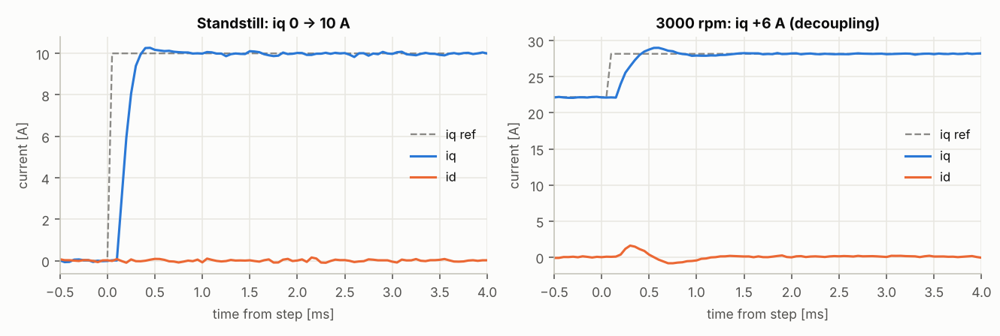
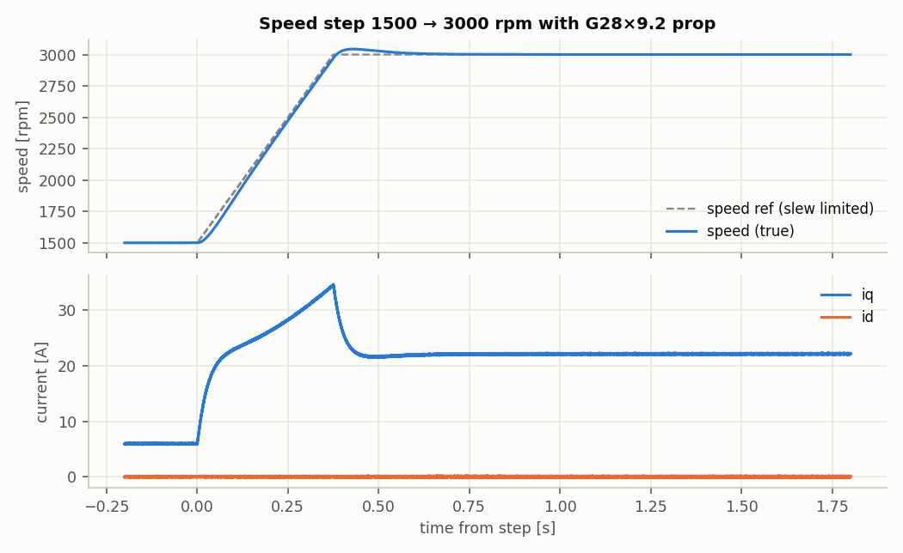
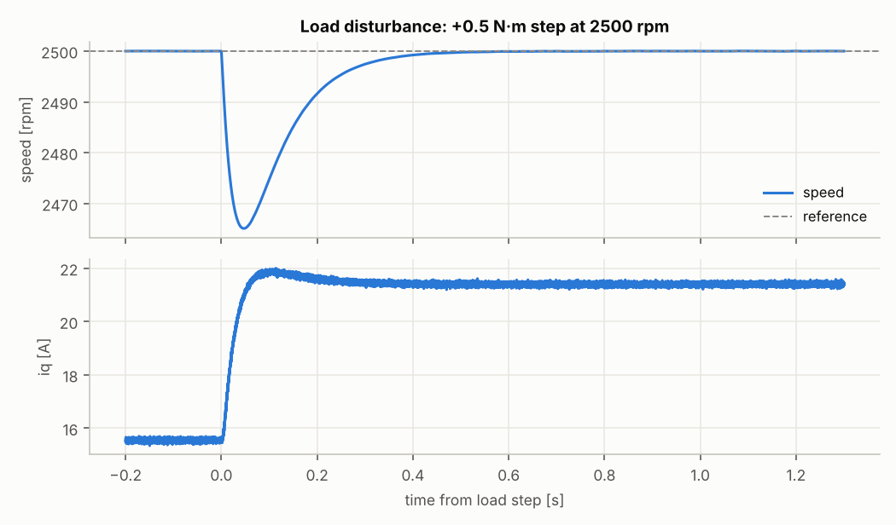
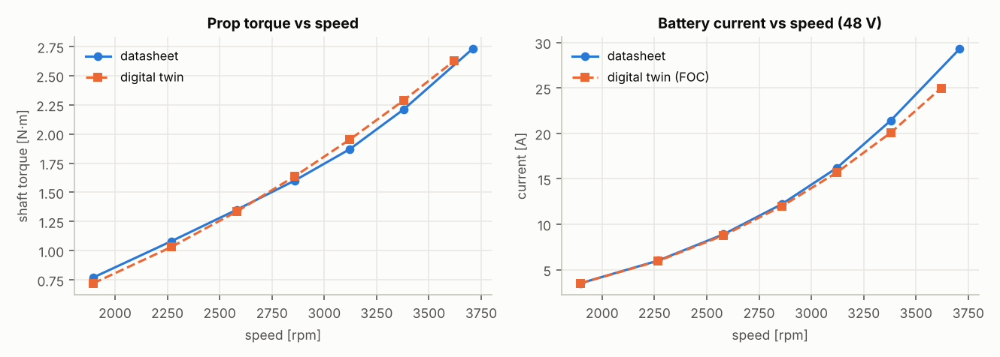
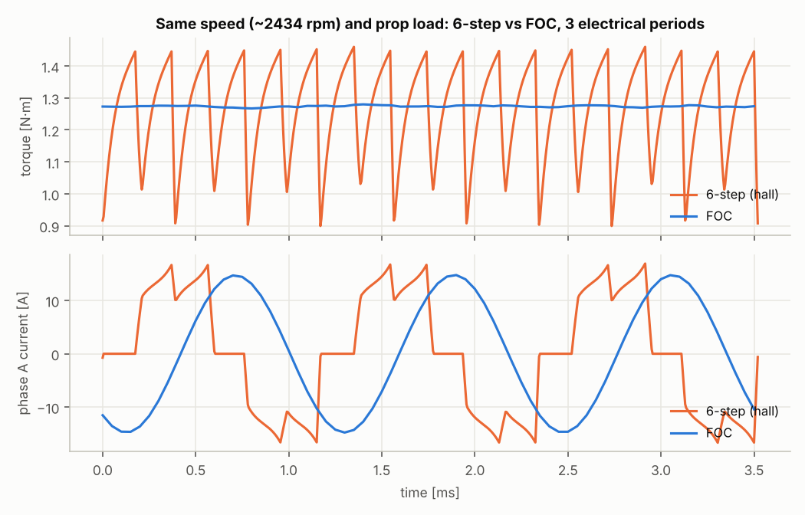
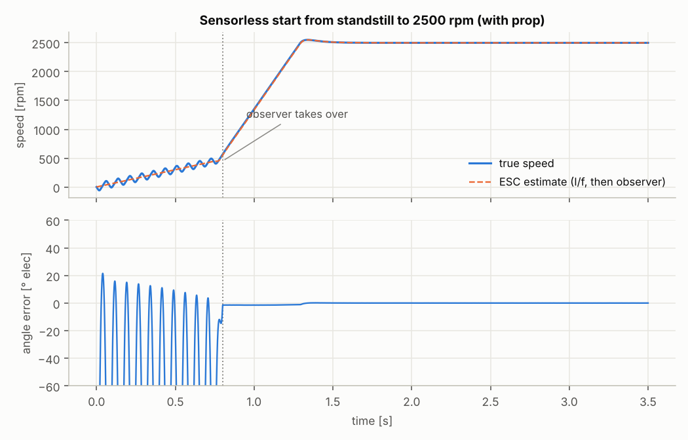
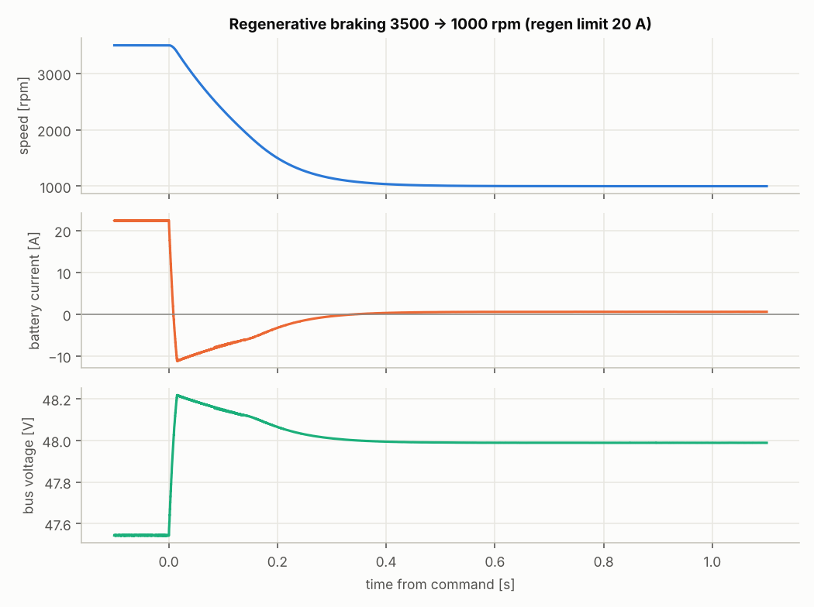
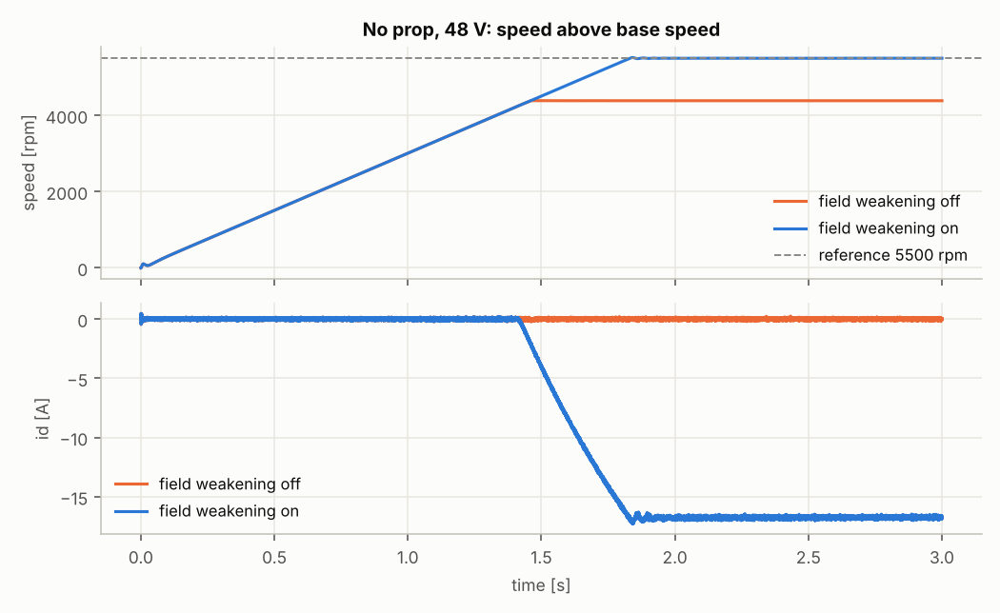

# FOC ESC Test Report — T-Motor U8 II KV100

**Device under test:** `esc/foc_esc.py`, a field-oriented control ESC with encoder and sensorless modes
**Plant:** digital twin of the T-Motor U8 II KV100 (36N42P) on 48 V with a G28×9.2 CF propeller
**Date:** 7 Oct 2026 · **Reproduce:** `python validation/foc_tests.py` (about 2 min) → `docs/foc_report/` · raw numbers: [`results.json`](foc_report/results.json)

---

## 1. Summary

| Area | Result | Verdict |
|---|---|---|
| Motor detection (R / L / λ) | errors of +0.14 % / +0.92 % / −0.53 % vs the twin's true values | ✅ |
| Encoder offset alignment | 0.009° electrical error (with prop attached) | ✅ |
| Current loop (1 kHz design) | 0.15 ms rise, 2.7 % overshoot at standstill; 13.8 % overshoot and 1.6 A d-axis coupling at 3000 rpm | ✅ / ⚠️ at speed |
| Speed loop (6 Hz design) | 1500→3000 rpm: follows the 4000 rpm/s ramp, 2.9 % overshoot, settled in 0.49 s | ✅ |
| Load disturbance (+0.5 N·m at 2500 rpm) | 35 rpm dip (1.4 %), back within ±10 rpm in 0.18 s | ✅ |
| **Agreement with the T-Motor datasheet** | battery current within **0–3 % from 40–80 % throttle**, 6 % low at 90 %, 15 % low at 100 % | ✅ up to 80 % |
| Torque ripple, FOC vs 6-step (same speed and load) | **1.3 % vs 44 % peak-to-peak**; FOC uses 2.8 % less battery power | ✅ |
| Sensorless start and run | I/f start → observer at 450 rpm → 2500 rpm in 1.29 s; angle error ≤ 0.7° up to 3500 rpm | ✅ |
| Regenerative braking | 3500→1000 rpm in 0.38 s at the 20 A regen limit; 75 J returned to the battery | ✅ |
| Locked rotor | current held at the 40 A limit; **no thermal derating, so the winding would reach 150 °C in about 73 s** | ⚠️ |
| Field weakening (no prop) | top speed raised from 4386 to 5500 rpm with id = −16.7 A | ✅ |

**Overall:** the FOC ESC is stable and accurate across every test. Two items need work before real hardware: thermal derating (the locked-rotor case) and better current-loop behaviour at high speed. Section 6 lists the recommendations.

---

## 2. Test setup

### 2.1 Motor model, and where each number comes from
| Parameter | Value | Source |
|---|---|---|
| Configuration | 36 slots / 42 poles → **21 pole pairs** | T-Motor datasheet |
| KV | 100 rpm/V | T-Motor datasheet |
| Resistance | 170 mΩ line-to-line → **85 mΩ per phase** (+2 mΩ FET) | T-Motor datasheet |
| Back-EMF shape | sinusoidal | typical for this motor class |
| → flux linkage λ, torque constant | 2.749 mWb, **Kt = 0.0866 N·m/A** (peak) | derived from KV |
| Inductance | **37 µH per phase** | *estimated*: back-calculated from the datasheet 100 % point (voltage limit at 3709 rpm, 2.73 N·m) |
| Friction | 0.033 N·m Coulomb + 1.77×10⁻⁴ N·m·s viscous | fitted to the datasheet idle current (0.7 A @ 18 V) |
| Prop load | T = 1.827×10⁻⁵ · ω² | fitted to the datasheet torque/rpm table (20 points, 0.046 N·m RMS residual) |
| Inertia | rotor 1.6×10⁻⁴ + prop 2.5×10⁻³ kg·m² | *estimated* (geometry) |
| Thermal | 1.0 K/W, 80 J/K | *estimated* |
| Supply | 48 V, 20 mΩ, 1000 µF bus capacitor; current-sensor noise 0.05 A RMS | test conditions |

Config file: [`motor_tmotor_u8ii_kv100.json`](../motor_tmotor_u8ii_kv100.json). Sources: [T-Motor U8 II KV100 product page (LigPower)](https://www.ligpower.com/product/u8-v2-u-efficiency-kv100.html), [T-Motor store, U8 II series](https://store.tmotor.com/goods.php?id=561).

### 2.2 ESC under test (`esc/foc_esc.py`)
- **Rates:** 20 kHz PWM, one current sample per period, and a one-period computation delay, as on a real MCU (with 1.5·Ts angle compensation).
- **Current control:** Clarke/Park transforms, d/q PI current loops tuned by pole-zero cancellation for 1 kHz bandwidth, cross-coupling and back-EMF feed-forward, voltage-circle limiting with anti-windup.
- **Modulation:** space-vector PWM with min/max injection; usable voltage is 95 % of Vbus/√3.
- **Speed control:** speed PI at 2 kHz with 6 Hz bandwidth, tuned from Kt and the inertia; 4000 rpm/s slew limit; 40 A current-vector limit; 20 A regen limit.
- **Field weakening:** a voltage-margin integrator drives id negative, down to −20 A.
- **Angle sources:**
  - **Encoder:** 14-bit, with automatic offset alignment.
  - **Sensorless:** Ortega non-linear flux observer (the VESC-style observer) with an 80 Hz PLL, I/f open-loop start, and a 50 ms blended handover at 450 rpm.
- **Motor detection:**
  - R from DC injection on the d axis;
  - L from a 2.5 kHz square-wave voltage on the d axis;
  - λ from the back-EMF during an open-loop spin.
- **Coupling to the twin:** each 50 µs period the ESC receives phase currents, bus voltage and (encoder mode) the shaft angle, and returns three duties. This is the same exchange as the UDP lock-step link. A run over real UDP against `motor/bldc_sim.py` gave the same steady state (iq 22.26 A over UDP vs 22.19 A in-process at 3000 rpm).

---

## 3. Results

### 3.1 Motor detection and encoder alignment
| Parameter | Measured by ESC | True (twin, at 27.8 °C) | Error |
|---|---|---|---|
| R (phase + FET) | 88.06 mΩ | 87.94 mΩ | +0.14 % |
| L | 37.34 µH | 37.00 µH | +0.92 % |
| λ | 2.7346 mWb | 2.7493 mWb | −0.53 % (KV from λ = 100.5) |
| Encoder offset | — | — | 0.009° electrical |

The detected values were then used to tune every loop in the tests below, as on a real ESC.

### 3.2 Current loop

| Step | Rise 10–90 % | Overshoot | Settling (2 %) | Peak d-axis coupling |
|---|---|---|---|---|
| iq 0 → 10 A at standstill | 0.15 ms | 2.7 % | 0.50 ms | 0.15 A |
| iq +6 A at 3000 rpm | 0.20 ms | 13.8 % | 1.35 ms | 1.59 A |

At standstill the loop behaves like a clean first-order 1 kHz loop. At 3000 rpm the electrical frequency is 1.05 kHz, so the controller has only 19 samples per electrical cycle, and the one-period delay causes extra overshoot and d-axis coupling. It still settles in 1.35 ms.

### 3.3 Speed loop and load disturbance

1500 → 3000 rpm with the prop. The speed follows the slew-limited reference (40 rpm RMS tracking error while ramping), overshoots by 2.9 % (44 rpm), and settles in 0.49 s. Peak iq is 34.7 A: the prop's aerodynamic torque plus the 2.66 g·m² inertia.

A +0.5 N·m step (a 38 % torque increase over the 1.33 N·m prop + friction load) at 2500 rpm: the speed dips by 35 rpm (1.4 %), comes back within ±10 rpm in 0.18 s, and iq rises from 15.5 to 21.4 A.

### 3.4 Validation against the T-Motor datasheet (G28×9.2, 48 V)

| Throttle | rpm | Torque, datasheet / twin [N·m] | Battery current, datasheet / twin [A] | Power, datasheet / twin [W] | Current error |
|---|---|---|---|---|---|
| 40 % | 1896 | 0.77 / 0.72 | 3.50 / 3.50 | 168 / 168 | 0 % |
| 50 % | 2268 | 1.08 / 1.03 | 6.00 / 5.95 | 288 / 286 | −0.8 % |
| 60 % | 2581 | 1.35 / 1.33 | 8.90 / 8.78 | 427 / 421 | −1.3 % |
| 70 % | 2858 | 1.60 / 1.64 | 12.20 / 11.97 | 586 / 574 | −1.9 % |
| 80 % | 3122 | 1.87 / 1.95 | 16.20 / 15.70 | 778 / 753 | −3.1 % |
| 90 % | 3379 | 2.21 / 2.29 | 21.40 / 20.06 | 1027 / 963 | −6.3 % |
| 100 % | 3709 / **3619** (twin max) | 2.73 / 2.62 | 29.30 / 24.95 | 1406 / 1198 | −15 % |

Each point was run under FOC speed control at the datasheet speed. The 100 % row is the twin's own top speed at full modulation, without field weakening.

The twin matches the real motor closely up to 80 % throttle. Above that it under-predicts current, because it doesn't model **iron loss, which rises with electrical frequency (up to 1.3 kHz here), or ESC switching and dead-time losses**. Both grow fastest at high power. Top speed comes out 2.4 % lower than the datasheet because the inductance is an estimate.

### 3.5 Torque ripple: FOC vs 6-step

| At ~2434 rpm, same prop | 6-step (hall) | FOC |
|---|---|---|
| Torque ripple, peak-to-peak | 44.3 % | **1.3 %** |
| Torque ripple, RMS | 11.5 % | 0.21 % |
| Phase current THD | 29.6 % | 0.06 % * |
| Phase current RMS | 10.89 A | 10.45 A (−4 %) |
| Battery current | 7.57 A | 7.36 A (**−2.8 %**) |

\* The twin uses averaged PWM with no dead time, so FOC current THD is ideal here. On hardware expect a few percent from dead time and PWM ripple.

### 3.6 Sensorless operation

The motor starts from standstill under I/f open-loop control (15 A) and hands over to the observer at 0.80 s (450 rpm). It reaches 2500 rpm at 1.29 s.

| Speed [rpm] | Mean angle error [° elec] | Ripple, peak-to-peak [°] | Speed estimate error [rpm] |
|---|---|---|---|
| 600 | 0.00 | 0.09 | < 0.01 |
| 1000 | −0.08 | 0.06 | < 0.01 |
| 2000 | −0.09 | 0.05 | < 0.01 |
| 3000 | +0.27 | 0.04 | < 0.01 |
| 3500 | +0.70 | 0.04 | < 0.01 |

A +0.5 N·m load step at 2000 rpm in sensorless mode: 35.5 rpm dip, peak angle error 0.62°, essentially the same as with the encoder.

**Finding:** during the I/f phase the heavy prop makes the rotor hunt around the forced angle, with about ±70 rpm speed oscillation and large angle swings (visible before the handover line). The handover works, but starts can be smoothed with a slower I/f ramp, higher I/f current, or by enabling the observer earlier (it locks well at 600 rpm).

### 3.7 Regenerative braking

Commanding 3500 → 1000 rpm with a high slew limit: iq is held at the −20 A regen limit (minimum −20.2 A), battery current reaches −11.2 A, the bus rises only to 48.22 V (the battery absorbs the energy), and 74.6 J is returned. Deceleration takes 0.38 s.

### 3.8 Locked rotor (protection)
With the rotor mechanically locked and 3000 rpm commanded, the current vector stays at **40.2 A** (limit 40 A); the highest phase current was 35.5 A. That dissipates 204 W in the copper, heating the winding at 2.55 K/s. **With no thermal derating, the model reaches 150 °C in about 73 s.**

### 3.9 Field weakening (no prop)

| | Top speed at 48 V | id | Battery current |
|---|---|---|---|
| Field weakening off | 4386 rpm (voltage limited) | 0 A | 1.13 A |
| Field weakening on | **5500 rpm** (reference reached) | −16.7 A | 2.77 A |

Field weakening extends the speed range by 25 %. The cost is about 37 W of extra copper loss from the d-axis current.

---

## 4. Defects found and fixed during this campaign
1. **Simulator, back-EMF constant for sine motors.** Kv was converted to Ke using the trapezoid formula for every shape, so sine-BEMF motors ran about 15 % fast. Ke now comes from the line-to-line 6-step window for any shape, and a regression test is in the suite.
2. **ESC, PLL timing.** The PLL angle was one PWM period ahead of the current-sampling instant (12° at 2000 rpm), costing about 4 % extra current. The PLL now predicts, then corrects, at the sample instant.
3. **ESC, observer voltage timing.** The flux observer integrated the voltage for the period about to be applied instead of the one just applied (one period ahead). Fixed.
4. **ESC, detection.** Identification ended with the motor still coasting, which spoiled the encoder alignment that followed. It now ramps down to standstill.
5. **Test bench, measurement method.** Battery current was sampled at the end of each period, which aliases at high speed; it is now period-averaged, like a DC power meter. Angle error is now compared at the same instant the ESC sampled.

Each fix was verified by re-running the full campaign; the results above are from the final run.

## 5. Limitations of these results
- Iron loss, PWM switching ripple, dead time and ESC switching losses are not modelled. Efficiency at high throttle is therefore optimistic (section 3.4).
- Inductance, inertia, cogging and thermal parameters are estimates. Measuring L and J on the real motor (the ESC's detection routine already does L) would tighten the top-speed and dynamic results.
- Propeller torque is a fitted ω² law: no inflow or forward-flight effects, and no prop inertia measurement.
- Current measurement is ideal apart from Gaussian noise: no ADC quantization, offset or gain error.

## 6. Recommendations before hardware
1. **Add thermal derating:** limit current as winding or FET temperature rises, plus a stall timeout. Today a stall would overheat the motor in about a minute.
2. **High-speed current loop:** add delay-aware decoupling (use the predicted current and angle) or a complex-vector PI to remove the 14 % overshoot and the 1.6 A d-axis coupling at 3000 rpm.
3. **Sensorless start:** move the handover earlier (about 300–400 rpm) or soften the I/f ramp for heavy props; also consider an HFI or sensored low-speed mode.
4. **Calibrate losses:** add a speed- and load-dependent iron-loss term to the twin, fitted to the 80–100 % datasheet points, so efficiency predictions hold at full power.
